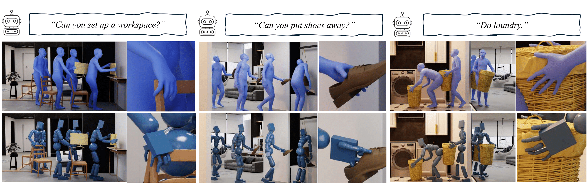

# Human-Object Interaction from Human-Level Instructions (ICCV 2025)

This is the official implementation for the ICCV 2025 [paper](https://arxiv.org/abs/2406.17840). For more information, please check the [project webpage](https://hoifhli.github.io/).



### Environment Setup
> Note: This code was developed on Ubuntu 20.04 with Python 3.8, CUDA 12.4, and PyTorch 1.11.0.

Clone the repo.
```
git clone https://github.com/zhenkirito123/hoifhli_release.git
cd hoifhli_release/
```
Create a virtual environment using Conda and activate the environment. 
```
conda env create -f environment.yml
conda activate hoifhli_env 
```
Install TorchSDF based on the instruction from [here](https://github.com/PKU-EPIC/DexGraspNet/blob/bd1b13d7248729af117e1d46aaa6266b147a3c7b/grasp_generation/README.md?plain=1#L30).

Install human_body_prior.
```
git clone https://github.com/nghorbani/human_body_prior.git
pip install tqdm dotmap PyYAML omegaconf loguru
cd human_body_prior/
python setup.py develop
```
Install BPS.
```
pip install git+https://github.com/otaheri/chamfer_distance
pip install git+https://github.com/otaheri/bps_torch
```
Install smplx.
```
pip install "smplx[all]"
```


### Prerequisites 
Please download [SMPL-X](https://smpl-x.is.tue.mpg.de/index.html) and put the model to ```data/smpl_all_models/```. The file structure should look like this:

```
data/
├── smpl_all_models/
│   ├── smplx/
│   │   ├── SMPLX_FEMALE.npz
│   │   ├── SMPLX_MALE.npz
│   │   ├── SMPLX_NEUTRAL.npz
│   │   ├── SMPLX_FEMALE.pkl
│   │   ├── SMPLX_MALE.pkl
│   │   ├── SMPLX_NEUTRAL.pkl
```

Then run the following script to download the data.
```
bash scripts/download_data.sh
```


### Sampling Long Sequences
Run the following script to sample long sequences.
```
bash scripts/sample.sh
```
By default, it will generate interaction motion with a box. You can change the object by modifying the ```--test_object_name``` argument.

### Training
You need to download the training data first. Run the following script to download the data. (**Note**: This script will delete `/data/processed_data` folder before re-downloading the training data. If you have any custom data stored there, make sure to back it up beforehand.)
```
bash scripts/download_training_data.sh
```

#### Training CoarseNet
```
bash scripts/train/train_coarsenet.sh
```

#### Training RefineNet
```
bash scripts/train/train_refinenet.sh
```

### Physics Tracking
Please refer to [here](./physics_tracking/README.md).


### Citation
```
@article{wu2024human,
  title={Human-object interaction from human-level instructions},
  author={Wu, Zhen and Li, Jiaman and Xu, Pei and Liu, C Karen},
  journal={arXiv preprint arXiv:2406.17840},
  year={2024}
}
```

### Related Repos
We adapted some code from other repos in data processing, learning, evaluation, etc. We would like to thank the authors and contributors of these repositories for their valuable work and resources.
```
https://github.com/lijiaman/chois_release
https://github.com/otaheri/GRAB
https://github.com/nghorbani/human_body_prior
https://github.com/PKU-EPIC/DexGraspNet
```